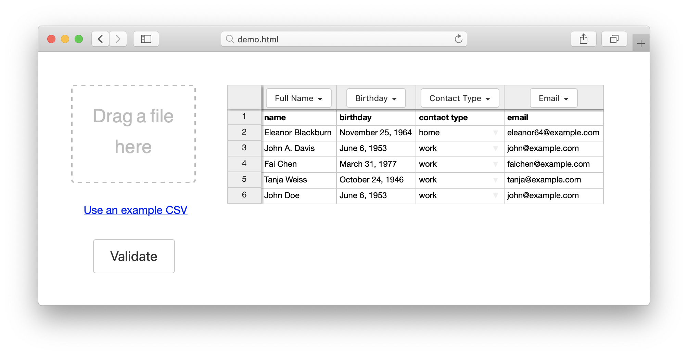
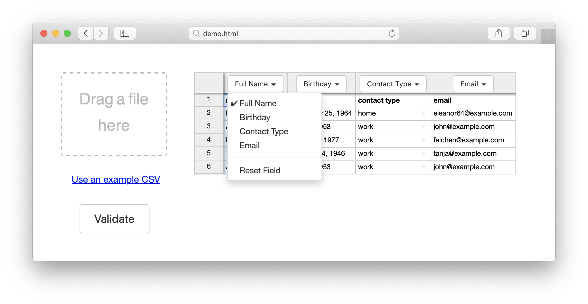
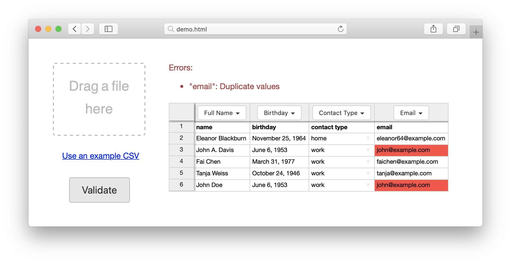

# DataImport.js

Simple JavaScript browser-based CSV importer. 

Inspired by Patrick McKenzie's [Design and Implementation of CSV/Excel Upload for SaaS](https://www.kalzumeus.com/2015/01/28/design-and-implementation-of-csvexcel-upload-for-saas/). DataImport is built on top of Handsontable and lets you do CSV input data pre-validation on in the browser.

[Demo on JSFiddle](https://jsfiddle.net/gh/get/library/pure/burnash/dataimport/tree/master/demo/)

## Example 

```javascript
var is = DataImport.is;

var containerElement = document.getElementById("handsontable-element");

var dataimport = new DataImport(containerElement, {
  fields: [{
    id: "fullName",
    name: "Full Name",
    required: true
  }, {
    id: "birthday",
    name: "Birthday",
    required: false,
  }, {
    id: "contactType",
    name: "Contact Type",
    required: true,
    choices: ["work", "home"],
    validate: [
      is.anyOf(["work", "home"], "Wrong value")
    ]
  }, {
    id: "email",
    name: "Email",
    required: true,
    validate: [
      is.unique(),
      is.matchingRegex(["[^@]+@[^\.]+\..+"], "Incorrect Email Address")
    ]
  }],
});

dataimport.validate({
  complete: function (result) {
    console.log(result);
  },
  fail: function (errors) {
    console.log(errors);
  }
});
```

## How it works

Here's what happens in the demo.

1. When the user adds a CSV file the fields in the files are matched to the `fields` described in `DataImport`. This example uses [Papa Parse](https://www.papaparse.com/) to load the data from CSV and [Fuse.js](https://fusejs.io/) to do fuzzy matching of fields.



2. If needed the user can fix automatic matching by selecting a proper field from the dropdown.



3. When the user clicks Validate, DataImport checks the data and displays the errors.



4. When there are no errors `DataImport.validate` calls `complete` callback with resulting data (array of arrays). This is your parced CSV data.

Check [Demo on JSFiddle](https://jsfiddle.net/gh/get/library/pure/burnash/dataimport/tree/master/demo/)
